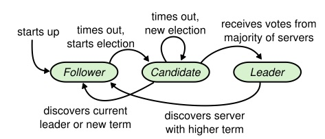
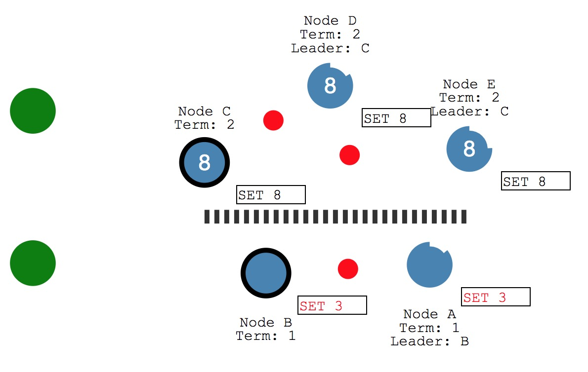

# RAFT Algorithm

Raft is a consensus algorithm for managing a replicated log. Raft separates the key elements of 
consensus, such as leader election, log replication, and safety.

## Leader Election
* Nodes start as followers. Followers only respond to requests from other servers. 
* If a follower receives no communication from leader within **Election Timeout**(which is 
randomized to be between 150ms and 300ms), it becomes a candidate and initiates an **Election 
Term**. 
* Candidates vote for themselves and send out **Request Vote** messages to other nodes.
* If the receiving node hasn't voted yet in this term then it votes for the candidate, and *reset 
its timeout*.
* A candidate that receives votes from a majority of the full cluster becomes the new leader. 
* The Leader typically operates until they fail. It sends out **Append Entries** messages to its 
followers. These messages are sent in intervals specified by the **Heartbeat Timeout**.

#### Vote Split
If two nodes become candidates at the same time then a split vote can occur. The nodes will wait 
for another election timeout and vote again.

## Log replication
* All changes to the system go through the leader.
* Each change is added as an entry in the node's log.
* To commit the entry, the leader first replicates it to the followers in the next heartbeat 
using the **Append Entries** message.
* When the majority as written the entry, it is committed on the leader. Then the leader 
responses to the client.
* Then leader then notifies the followers that the entry is committed.
* The cluster now comes to consensus about the state.

## Safety
**New leader is guaranteed to have the latest committed logs**
* **RequestVote RPC** brings with the index of candidate’s last log entry and the term of 
candidate’s last log entry.
* The receiver only grant vote when the candidate’s log is at least as up-to-date as receiver’s log.

**Network partitions tolerance**

* Node B cannot replicate to a majority so its log entry stays uncommitted.
* Node C will succeed because it can replicate to a majority.
* Node B will see the higher election term and step down.
* Both nodes A & B will roll back their uncommitted entries and match the new leader's log.

## Compare with Paxos
* Paxos uses a symmetric peer-to-peer approach at its core. This makes sense in a simplified world 
where only one decision will be made, but if a series of decisions must be made, it is simpler 
and faster to first elect a leader, then have the leader coordinate the decisions.
* Raft produces a result equivalent to (multi-)Paxos, and it is as efficient as Paxos, but its 
structure is different from Paxos; this makes Raft more understandable than Paxos and also provides a better foundation for building practical systems. 

## REF
* https://raft.github.io/raft.pdf
* http://thesecretlivesofdata.com/raft/
* https://zhuanlan.zhihu.com/p/27207160